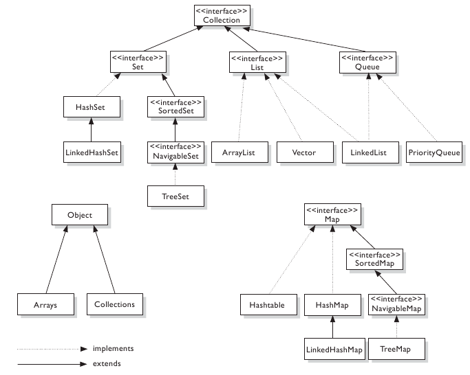

# Colecciones En JAVA 

_El lenguaje de programación JAVA integra un framework aplicado a un conjunto de estructuras de datos, esto facilita la vida de los programadores a la hora de resolver problemas._

_Utilizandolas podemos abstraertnos de la implementacion de dichas estructuras de datos y usarlas libremente en los limites definidos por el framework._

---

## Tipos de colecciones 📋

### Set

_La interfaz `Set` define una colección que no puede contener elementos duplicados. Esta interfaz contiene, únicamente, los métodos heredados de Collection añadiendo la restricción de que los elementos duplicados están prohibidos ya que se relaciona al `set` con el concepto de conjunto matemático._

_Dentro del framework existen diferentes implementaciones de `set` que funcionan ligeramente diferente_

* `HashSet`:
  
  Esta implementación proporciona tiempos constantes en las operaciones básicas siempre y cuando la función hash disperse de forma correcta los elementos dentro de la tabla hash. 

* `TreeSet`:

  Encapsula el comportamiento de un arbol binario, por lo que esta ordenado inOrden. La clase de los objetos que se van a almacenar en el TreeSet tienen que ser del tipo comparable y cotar con el método compareTo o tener un Comparator, que debería pasarse como parámetro al constructor del set.
  
  
* `LinkedHashSet`:

  Almacena los elementos en función del orden de inserción. Las claves se almacenan en función del orden de inserción. Proporciona funcionalidades tanto de la tabla hash como de la estructura de datos de la lista vinculada.

#### Métodos clave
* `add(elemento); ` // añade un elemento al set.
* `remove(elemento);` // quita un elemento del set.
* `clear();`			//vacía el set.
* `toArray();`	// devuelve un array del tipo Object[] que contiene los elementos del set;
* `contains(elemento)`    //  devuelve True si el set contiene el elemento enviado como parámetro o false si no lo contiene.

---
### List

_Al igual que `SET`, `LIST` es una interfaz, por lo tanto no se puede instanciar lo que hace es englobar dos comportamientos en particular, `ArrayList` y `LinkedList`. Las listas tienen acceso directo por índice, y tiene los elementos ordenados de la forma que se ingresaron. El tamaño es flexible._

* `ArrayList`:
  Es una clase que encapsula el comportamiento de un array primitivo, pero tiene ciertas ventajas. Por ejemplo, le podemos insertar elementos sin preocuparnos de redimensionarlo ya que se redimensiona solo. Cuando la cantidad de elementos llega a una cantidad especifica (75% por ejemplo) se redimensiona con un 50% más. Cuando declaramos la lista podemos indicarle el tamaño que queremos. En la implementación tiene un array primitivo, y tiene métodos para simplificar su uso, por ejemplo, con el método get obtenemos lo que contiene una posición específica del array.También es muy útil que al añadir o eliminar un elemento el resto se reacomoda hacia la izquierda o derecha, según corresponda, sin dejar espacios en el centro.

* `LinkedList`: 
  es una clase que encapsula el comportamiento de una lista, esta implementada con nodos por lo que una de sus ventajas es que no hay memoria sin usarse. Otra ventaja es que cuando se quiere eliminar un elemento de la lista, es tan simple como conectar el nodo anterior con el siguiente. Una desventaja es que tiene acceso secuencial.

 #### Métodos clave
* `add(elemento);`  // añade un elemento a la lista.
* `add(indice, elemento);`  // añade un elemento a la lista en la posición enviada como índice.
* `remove(elemento);` // quita un elemento de la lista .
* `remove(indice);`  // quita el elemento de la lista ubicado en la posición enviada como índice.
* `clear();	`		//vacía la lista.
* `toArray();`	// devuelve un array del tipo Object[] que contiene los elementos del set;
* `contains(elemento);`    //  devuelve True si la lista contiene el elemento enviado como parámetro o false si no lo contiene.
* `get(indice);`     // devuelve el elemento ubicado en esa posición.
* `sort(comparator);`     // ordena la lista según el criterio del comparator enviado.


#### Transformaciones
  
_El contenido de un array o una `List` puede convertirse a un `set` de manera muy sencilla, o viceversa, pasando por parámetro los datos en el `constructor` de la nueva estructura._

```java
String[] nombres = { "Juan", "Jorge", "Ramon", "Juan", "Carlos", "Roberto", "Jorge", "Marcos", "Hernesto","Raul", "Rodolfo", "Miguel" };

ArrayList<String> lista = new ArrayList<String>(Arrays.asList(nombres));      
// Creamos una lista a partir de un array. Arrays.asList() actúa como un puente para transformar un array primitivo en una colección.

Set<String> set = new TreeSet<String>(Arrays.asList(nombres));				
//Creamos un Set a partir de un array.

ArrayList<String> lista2 = new ArrayList<String>(set);					
//Creamos una lista a partir de un set.

Set<String> set2 = new TreeSet<String>(lista);						
//Creamos un set a partir de una lista.		
```

#### Recorrido

_Recorrer el contenido de una `List` o un `set` puede hacerse de distintas formas._

Una de ellas es usando un `Iterator`. Se puede emplear en un `for` de la siguiente forma:

```java
ArrayList<String> listaNombres = new ArrayList<String>(Arrays.asList(nombres));   

for (Iterator<String> iterator = listaNombres.iterator(); iterator.hasNext();) {
  System.out.println(iterator.next());
}

Set<String> setNombres = new TreeSet<String>(Arrays.asList(nombres)); 

for (Iterator<String> iterator = setNombres.iterator(); iterator.hasNext();) {
  System.out.println(iterator.next());
}
```

O también podría usarse en un `while`:

```java
Iterator<String> iterator = setNombres.iterator();
while( iterator.hasNext()) {
  System.out.println(iterator.next());
}
```

Otro modo es utilizando un `for` del siguiente tipo:
```java
for (String palabra : listaNombres) {
  System.out.println(palabra);
}
```

En este ejemplo dentro de la variable "palabra" se van asignando los distintos valores que contiene la `List` o el `Set`, permitiendo hacer lo que se necesite con cada uno. El control de pasar de un elemento al siguiente y terminar cuando se llega al último es automático.

En el caso de las listas (con los sets no se puede) también podría utilizarse un `for` tradicional:
```java
for(int i=0;i<listaNombres.size();i++) {                      
//size() devuelve la cantidad de elementos de la colección.
  System.out.println(listaNombres.get(i));
}
```
---
### Maps
_Esencialmente es diferente a los `Set` y las `List`. Un mapa tiene forma de dos conjuntos, uno de claves y otro de valores, y hay una correspondencia univoca entre claves y valores. Es una colección asociativa en la que por medio de una clave obtengo un valor. Un ejemplo de uso es el de contar los nombres en una `List`, si tuviéramos la key “lucas� repetida tres veces en una `List` de nombres, para la key “lucas� tendríamos el valor 3. Otro ejemplo sería agrupar los países por continente, siendo las key los continentes y los valores, listas de nombres de los países. La implementación que vemos es Hashmap._

* `HashMap`:
  
  Esta implementacion del mapa se basa en tablas de hash para calcular los pares de clave valor, esta implementacion permite el uso tanto de claves como valor nulos. Ademas proporciona acceso a los metodos basicos en tiempo constante.

* `TreeMap`:
  
  Este mapa esta basado en un arbol, los elementos se insertan de forma ordenada en el arbol de acuerdo a el orden natural de las claves o a un Comparador que puede ser provisto a la hora de crear el Map.

* `LinkedHashMap`:
  
  La diferencia principal entre esta implementacion del mapa es que tiene en su interior una lista doblemente enlazada por lo que recorrer el conjunto de claves proporciona un orden que puede ser esperado.


#### Métodos clave
* `put(clave,valor);`   //   añade un nuevo par al map.
* `get(clave);`  // recibe una clave y devuelve el valor asociado, si no contiene la clave devuelve null.
* `getOrDefault(clave, default);`  // recibe una clave y devuelve el valor asociado, si no contiene la clave devuelve el valor enviado como default.
* `remove(elemento);` // quita un elemento del map, con su valor.
* `clear();	`		//vacía el map.
* `containsKey(elemento);`    //  devuelve True si el map contiene como clave el elemento enviado como parámetro o false si no lo contiene.
* `containsValue(elemento);`   //  devuelve True si el map contiene el elemento enviado como parámetro en alguno de los valores, o false si no lo contiene.
* `keySet();`    //  devuelve un set con todas las claves del map, este a su vez tendrá todos los métodos de los sets.


#### Recorrido
  
_Al ser tan distintos los mapas no pueden recorrerse de la misma forma que las `List` y los `Set`, pero si de una muy similar._

_Tomando como ejemplo el siguiente `Map`, que contiene `strings` en sus claves y `enteros` en sus valores:_

```java
HashMap<String,Integer> mapa=new HashMap<String,Integer>();
mapa.put("Carlos", 3);
mapa.put("Roberto", 4);
mapa.put("Hernesto", 7);
mapa.put("Jorge", 1);
mapa.put("Ricardo", 9);
```

Se podría recorrer con un `Iterator`, pero a diferencia de las `List` y `Set` debe crearse sobre el `keySet` del mapa.

```java
Iterator<String> iterator = mapa.keySet().iterator();         
while( iterator.hasNext()) {
  String sig=iterator.next();
  System.out.println(sig +": "+mapa.get(sig) );				
}
```

También puede usarse un `for` como el de los `Set` y las `List`, nuevamente operando sobre el `keySet`:

```java
for (String palabra : mapa.keySet()) {
  System.out.println(palabra+": "+mapa.get(palabra));
}
```

Otra forma de recorrerlos es utilizando el `entrySet` del mapa que devuelve todos los pares clave-valor del mapa

```java
for (Map.Entry<String, Integer> entrada: mapa.entrySet()) {	
  // Cada entrada del entrySet contiene un par clave-valor del map
  System.out.println(entrada);
}
```



_Imagen tomada de Oracle_

## Ejemplo de colecciones con Objetos!
 Los ejemplos vistos tambien pueden aplicarse en objetos. Por ejemplo si tenemos una Clase llamada persona: 
 

    public class Persona implements Comparable<Persona> {

	private String nombre;
	private String ciudad;
	private int edad;
	private int sueldo;

	public Persona(String identificacion, int anios) {
		nombre = identificacion;
		edad = anios;
	}

- TreeSet: 

    Set<Persona> personasOrdenadas = new TreeSet<Persona>(); 
	

    personasOrdenadas.add(new Persona("CiudadA", 20));
    personasOrdenadas.add(new Persona("CiudadB", 21));
    personasOrdenadas.add(new Persona("CiudadC", 19));
    
  En el codigo se adjunta una clase persona Completa, junto a tests para probar el uso de TreeSet con instancias
  de dicha clase.En el test podemos ver ejemplos de: 
  A) Ordenamiento Inverso
  B) Remover Objetos
  C) Uso de Lambdas
    

## Fuente 📖

_Esta información está basada en la documentacion oficial del [Java Collections Framework](https://docs.oracle.com/javase/8/docs/technotes/guides/collections/overview.html)_

