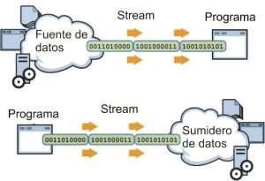

# Entrada / Salida 
## E/S con flujos (streams)
- El sistema de entrada/salida en Java, usa la abstracción del flujo de datos (conocido como stream) para tratar la comunicación de información entre el programa y los medios externos. Estos medios externos pueden ser la pantalla, el teclado, los archivos, los sockets de red, e incluso otro programa. Cualquier programa que precise información de alguna fuente externa, necesitara al menos abrir un stream. De igual forma, si se requiere enviar información hacia un medio externo, también se necesitara abrir un stream.

- Los flujos son secuencias ordenadas de datos que tienen una fuente (flujos de entrada) o un destino (flujos de salida).



A continucaion mostramos un ejemplo basico de manejo de archivos. En este caso vamos a leer de un arhcivo con el nombre "uno.in" que contiene numeros, los cargamos en memoria  luego trabjamos con esos numeros(elevamos al cuadrado) y guardamos los resultados en otro archivo llamado "uno.out".

### Creacion de Clase Archivo

Creamos la clase `Archivo` que tiene un atributo de tipo `String`.

```java
public class Archivo {
	private String nombre;
	public Archivo(String nombre) { //Constructor
		this.nombre = nombre;
	}
}
```
***
### ¿Como leer un archivo?
Es importante saber el formato de entrada que recibimos, en esta caso tenemos una entrada con el siguiente formato.
- La primera linea indica la cantidad de numeros que contiene.
- La segunda linea los numeros separados por espacios en blancos.

uno.in
```
5
2.2 4.4 8.8 16.16 30
```
#### Metodo leerArchivo
- El metodo nos devuelve un array del tipo de dato `double`.

- Utlizamos la clase [`Scanner`](https://docs.oracle.com/javase/7/docs/api/java/util/Scanner.html) que viene en el paquete java.util utilizada para obtener la entrada de los tipos primitivos como int, double, etc. y también String.

- Para crear un objeto de clase Scanner, normalmente pasamos el objeto predefinido System.in, que representa el flujo de entrada estándar. Pero podemos pasar un objeto de clase [`File`](https://docs.oracle.com/javase/7/docs/api/java/io/File.html) si queremos leer la entrada de un archivo.

```java
public double[] leerArchivo() {
	Scanner arch = null;
	double[] datos = null;
	try {
		arch = new Scanner(new File("casos de prueba/in/" + this.nombre + ".in"));
		arch.useLocale(Locale.ENGLISH);//especifica la configuración regional que se va a utilizar
		int cant = arch.nextInt();
		datos = new double[cant];
		for (int i = 0; i < cant; i++) {
			double n = arch.nextDouble();
			datos[i] = n;
		}
	} catch (Exception e) {
		e.printStackTrace();
	} finally {
		arch.close();//Cerrar el archivo ,eso es mucho muy importante.
	}
	return datos;
}
```
***
### ¿Como guardar un archivo?
- Uilizamos la clase [`FileWriter`](https://docs.oracle.com/javase/7/docs/api/java/io/FileWriter.html) que nos permite realizar escrituras de caracteres de texto sobre un archivo.
- La clase [`PrintWriter`](https://docs.oracle.com/javase/7/docs/api/java/io/PrintWriter.html) soporta diferentes tipos de datos para imprimir desde los mas primitivos como números, texto hasta arrays y objetos.

```java
public void guardarArchivo(double[] datos) {
	FileWriter archivo = null;
	PrintWriter pw = null;
	try {
		archivo = new FileWriter("casos de prueba/out/" + this.nombre + ".out");
		pw = new PrintWriter(archivo);
		for(int i = 0; i < datos.length; i++) {
			pw.println(datos[i]); //Imprime los datos y hace un salto de linea.
		}
	} catch (Exception e) {
		e.printStackTrace();
	} finally {
		if (archivo != null) {
			try {
				archivo.close();
			} catch (IOException e) {
				e.printStackTrace();
			}
		}
	}
}
```
***
### Probamos el codigo

Ahora solo nos queda probar el codigo.

```java
public class Main {
	public static void main(String[] args) {
		Archivo archivo = new Archivo("uno");
		double[] datos = archivo.leerArchivo();
		// Elevo al cuadrado
		for(int i = 0; i < datos.length; i++) {
			datos[i] = (double)Math.round(datos[i] * datos[i] * 10000d) / 10000d;
		}
		archivo.guardarArchivo(datos);
	}
}
```

Resultado esperado

uno.out
```
4.84
19.36
77.44
261.1456
900.0
```
***
#### Bibliografía
*Curso de programación Java - Abraham Otero*

*http://www.javahispano.org/portada/2011/7/5/curso-de-programacion-java-v-abraham-otero.html*

 *Streams en Programación Orientada a Objetos*
 
 *https://slideplayer.es/slide/3789298*


