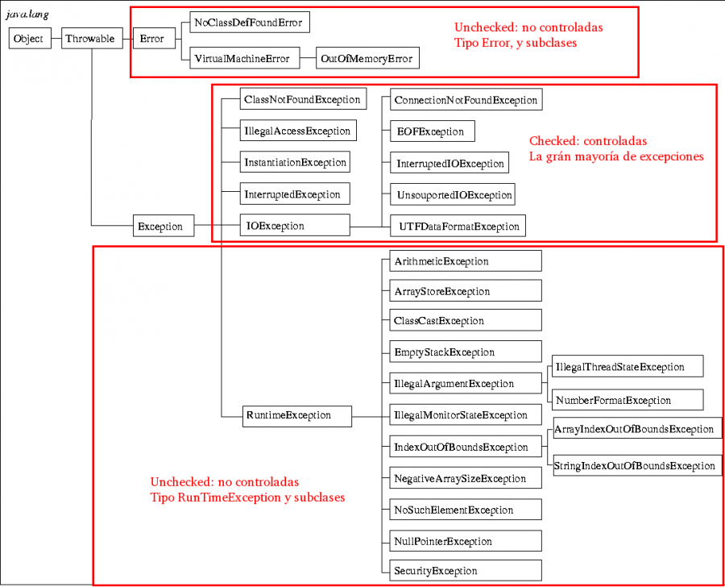

# Excepciones
Las mismas representan condiciones excepcionales que el programador busca darles un tratamiento especial, El manejo de las mismas permite bifurcar el flujo de la ejecución.
El proyecto cuenta con diferentes pruebas que intentan mostrar cómo es posible atrapar distintos tipos de excepciones, como tratarlas, cuáles son los bloques utilizados para atraparlas correctamente y cómo podemos definir nuestra propia excepción.

## Explicacion tipos excepciones
Existen 2 tipos de excepciones: verificadas y no verificadas, las primeras son aquellas que se deben declarar en el método mediante la palabra throws y obligan al método que lo llama a realizar el manejo de dicha excepción mientras que las excepciones no verificadas son aquellas que no son necesarias declararlas en el método y no obliga al método que lo llama a hacer el tratamiento de dicha excepción. En las pruebas estaremos trabajando con excepciones del tipo verificadas.

##### Imagen obtenida de :http://programacion.codeandcoke.com/doku.php?id=bloque3:excepciones

##### unchecked = no verificada
##### checked = verificada

 
## Explicación de la finalidad de las pruebas realizadas

### Prueba 1
Se demuestra como la División por cero lanza una excepción del tipo `ArithmeticException`, y para poder comprobarlo a través de la prueba se indica en la línea 12 que esperamos que sea lanzada una excepción del tipo aritmética.

### Prueba 2
Se demuestra cómo es posible atrapar la excepción que provoca la División por cero utilizando un bloque try catch , cuando esto ocurra el flujo bifurcara hacia el bloque catch que mostrara la pila de llamados hasta que se lanzó la excepción.

### Prueba 3
Se procede a atrapar una excepción del tipo `FileNotFoundException` que será provocado al tratar de crear un objeto de la clase `Scanner` con un archivo inexistente, esto provocara que bifurque por el bloque catch mostrando la pila de llamados hasta que se lanzó la excepción, y por último continuara por el bloque finally donde en caso de que se haya abierto el archivo procederá a cerrarlo, Se aclara que el bloque finally siempre se ejecuta.

### Prueba 4
Creamos una excepción propia genérica que hereda de la clase `Exception` y realizando un throw en el bloque try podemos arrojar una excepción atrapándola y mostrando nuevamente la pila de llamados hasta que se lanzó la excepción.

### Prueba 5
En esta prueba mostramos como camuflar el lanzamiento de una excepcion a partir de `MiException`(excepcion creada por nosotros). Al intentar dividir por cero, se produce una `ArithmeticException` que, en su bloque catch, lanza `MiException`. Esta ultima es atrapada en su bloque catch correspondiente y finalmente muestra la pila de llamados hasta que se lanzo la excepcion.
## Puntos de extensión 
Se podrían realizar una prueba donde se cree una excepción propia que pueda lanzar excepciones del tipo no verificadas 

# Fuentes
###### https://aprendiendoaprogramarbyem.blogspot.com/2016/08/excepciones-verificadas-y-no-verificadas.html
###### http://programacion.codeandcoke.com/doku.php?id=bloque3:excepciones

# Bibliografía Adicional
https://docs.oracle.com/javase/tutorial/essential/exceptions/index.html
