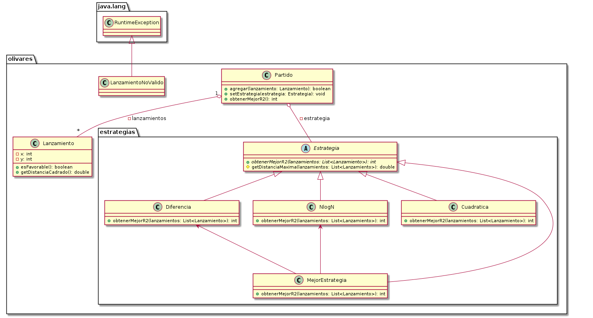

# Lanzamiento de Aceitunas
Si bien puede resolverse de diversas formas, y en rigor con sólamente una era suficiente, por fines didácticos se decidió hacerlo de dos maneras diferentes.

## Diagrama de clases

## Estrategias
Se utilizó el patrón de diseño *Strategy* para plasmar las dos posibles estrategias a utilizar.

### Estrategia NlogN
Esta estrategia ordena los lanzamientos según la distancia al centro, y va acumulando puntuación conforme se aleja del centro. Escoge el radio cuadrado más pequeño para el cual se obtenga un triunfo, o al menos un empate.

### Estrategia Diferencia
Esta estrategia recorre los lanzamientos una única vez, agregando su puntuación individual a un arreglo que se utiliza como "memoria", para luego propagar la puntuación y escoger el R2 más pequeño que maximiza el resultado del partido.

### Estrategia Cuadrática
La implementación más naïve, que para cada R2 posible, si es favorable o no, comparando contra cada tiro registrado. Funciona, pero tiene un límite de tamaño dada su elevada complejidad computacional.
