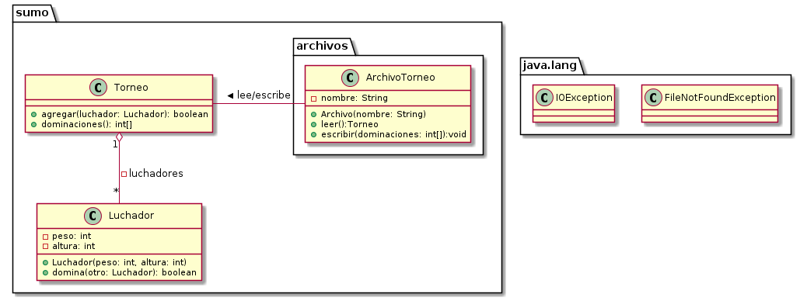

# Luchadores Japoneses
Este ejercicio nos solicita calcular un listado de dominaciones para un torneo de luchadores de sumo. Dado un listado de luchadores, representado por sus pesos y alturas, debemos devolver un listado de cuántos luchadores dominará cada uno de ellos.

## Diagrama de clases



## Estrategias de resolución
Dado que debemos comparar de algún modo a todos los luchadores entre sí, la resolución no podrá escapar de una complejidad de O(n<sup>2</sup>). Por lo tanto, en algún sitio del código fuente encontraremos un fragmento similar a esto:

```
para cada luchador, uno
  para cada luchador, dos
    si (uno.domina? dos)
      ...
```

Como podemos ver, eso requiere que visitemos n veces a los n luchadores. Una pequeña mejora que podríamos aplicar es realizar la comparación opuesta, y reutilizar los mismos accesos al arreglo. Sería algo así:

```
para cada luchador, uno
  para cada luchador, dos
    si (uno.domina? dos)
      ...
    si (dos.domina? uno)
      ...
```

De esa manera podríamos reducir los rangos de iteración de ambos ciclos. Sin embargo, [no podremos bajar la complejidad computacional del problema](https://stackoverflow.com/questions/22676911/time-complexity-of-comparing-the-elements-in-the-same-array-to-each-other-only-o) que queda en O(n<sup>2</sup>). Esta última implementación es la que se utilizó para desarrollar el ejercicio.
