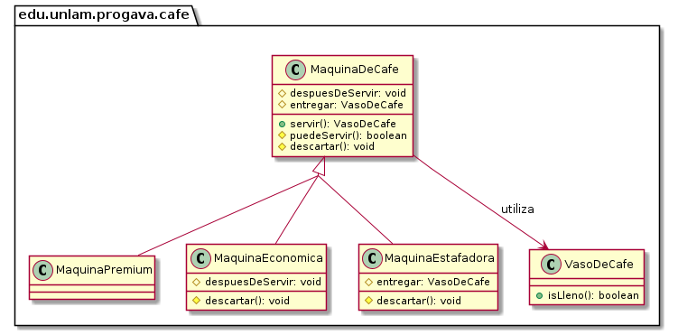

# Máquinas de Café

## Consigna

Se desea modelar el comportamiento de una empresa de máquinas de café. La misma vende dos líneas: la premium, y la económica. La premium, utiliza los granos de café una sola vez, por lo que el sabor es consistente. La económica utiliza los granos tres veces antes de descartarlos, por lo que la concentración de café va bajando.

¿Cómo modelamos esta situación?

## Segundo incremento

Se desea agregar un nuevo modelo de máquina, que estafa a su clientela. Una de cada dos veces entrega un vaso vacío.

## Diagrama de clases

