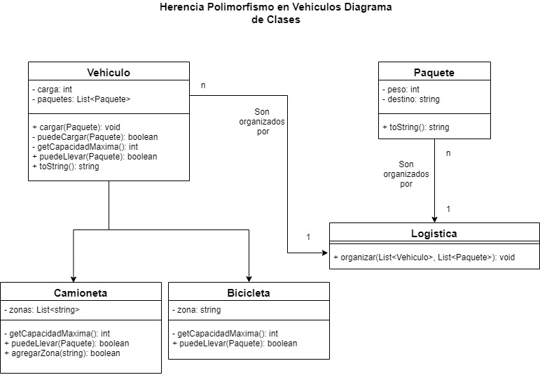

# Logística de Paquetería 
  

Este problema tiene como objetivo demostrar cómo utilizar la herencia y el polimorfismo, utilizando para ello un problema simple:

> Se desea asignar paquetes a vehículos, para poder distribuirlos.

## Tabla de contenidos
* [Características especiales del problema](#caracteristicas-especiales-del-problema)
* [Puntos de extensión](#puntos-de-extension)
* [Tecnologias](#tecnologias)
* [Detalle de clases](#detalle-de-clases)
* [Diagrama de clases](#diagrama-de-clases)
* [Contribuciones](#contribuciones)

## Caracteristicas especiales del problema

1. Los paquetes tienen un destino y un peso. Para simplificar utilizaremos `String` e `int` respectivamente.
2. Los vehículos pueden cargar hasta cierto peso límite.
3. Un tipo de vehículo es una bicicleta, que tiene una zona fija y un límite de 20 kilogramos de carga.
4. El otro tipo de vehículo es una camioneta, que tiene la posibilidad de ir a varias zonas, y un límite de 2000 kilogramos de carga.

## Puntos de extension

* Se podría agregar un transporte Courier, que vaya a donde sea necesario (siempre acepta el paquete).
* Se podría agregar el concepto de volumen del paquete.
* El paquete podría conocer si fue asignado o no.
* Podría ofrecerse una optimización para utilizar tan pocos transportes como sea posible (¿Ordenar los transportes por mayor cantidad de destinos primero? ¿Destinos disjuntos?)

## Tecnologias

1. Java
2. Junit

## Detalle de clases

### :large_blue_diamond: Vehiculo
* Clase abstracta que representa un tipo de vehiculo por el cual se realizaran los distintos envios de ***paquetes***, se tiene en cuenta que existe una diferencia entre los paquetes que podria cargar una ***bicicleta*** o un ***camion***, acorde a su capacidad maxima.

### :bike: Bicicleta
* La misma es una subclase de ***vehiculo***, que puede llevar paquetes a una sola zona especifica y puede llevar una carga de paquetes que en total no superen un peso igual a 20 kilogramos.

### :truck: Camioneta
* La misma es una subclase de ***vehiculo***, que puede llevar paquetes a varias zonas y puede llevar una carga de paquetes que en total no superen un peso igual a 2000 kilogramos.

### :package: Paquete
* Esta clase va a representar un objeto que se necesita llevar a un destino y que contiene un peso.

### :earth_americas: Logistica
* Esta clase es el manager del envio de paquetes, se encargara de asignarle a los diferentes vehiculos los paquetes a entregar.

## Diagrama de clases

## Contribuciones

* Las contribuciones a este proyecto siempre son bienvenidas. Para contribuir por favor primero cree un Fork ([¿Como lo hago?](http://kbroman.org/github_tutorial/pages/fork.html)), luego cree un Pull Request donde se discutira sobre los cambios.
* Por favor a cada cambio que agregues ¡No olvides mantener el test coverage!

