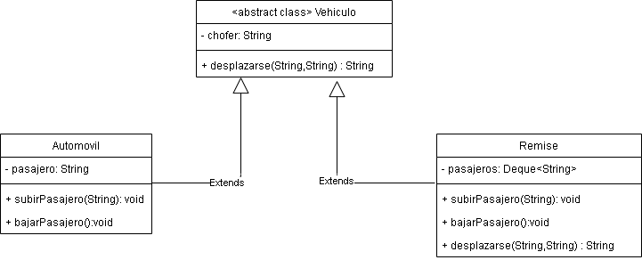

# Indice

*   [Conceptos generales](#Herencia-y-Polimorfismo)
*   [Proyecto vehiculo](#proyecto-vehiculo)
*   [Proyecto triatlon](#proyecto-triatlon)
*   [Contribuciones](#contribuciones)
*   [Autores](##autores-✒️)

# Herencia y Polimorfismo

### Herencia
 En un lenguaje con herencia de clases, son éstas las que definen de qué otra u otras clases heredan, dejando establecido de un modo explícito (y generando un acoplamiento jerárquico) cuál será su estructura y su posición en la taxonomía de tipos que se está generando.
En otras palabras, la herencia es un pilar importante de OOP (Programación Orientada a Objetos). Es el mecanismo en Java por el cual una clase permite heredar las características (atributos y métodos) de otra clase.

## Polimorfismo
 La habilidad de un elemento del texto del software para denotar, en tiempo de ejecución, dos o más posibles tipos de objeto. La esencia del polimorfismo es esa, y es el pilar más fuerte de la Programación Orientada a Objetos. Si no lo tuviéramos, poco valor agregado tendría toda la ceremonia adicional necesaria para resolver un problema.

## Clases abstractas e interfaces
Habrá ocasiones en las cuales necesitemos crear una clase padre donde únicamente coloquemos la estructura de una abstracción, una estructura muy general, dejando que sean las clases hijas quienes definan los detalles. En estos casos haremos uso de las clases abstractas. Una clase abstracta es practicamente identica a una clase convencional; las clases abstractas pueden poseer atributos, métodos, constructores, etc ... La principal diferencia entre una clases convencional y una clase abstracta es que la clase abstracta debe poseer por lo menos un método abstracto.
A diferencia de una clase abstracta, una interface no puede hacer nada por sí sola, es prácticamente un contrato, en donde las clases que la implementen deben, obligatoriamente, definir el comportamiento de todos los métodos abstractos, contestando a la pregunta ¿Cómo se debe hacer?

# **Proyecto Vehiculo** 

A continuacion se deja una aproximacion al problema con un diagrama de clases:

## **Explicacion de las clases**

**`Vehiculo`:** es una clase abstracta que posee los metodos que las clases hijas deben implementar

**`Remis`:** es otra clase hija de vehiculo, posee la implementacion de los metodos de la clase padre como a la clase mas le es conveniente.

**`Automovil`:** es otra clase hija de vehiculo, posee la implementacion de los metodos de la clase padre como a la clase mas le es conveniente.

## **Tests**

 **queConocenSusTipos():** El fin de este test es corroborar el funcionamiento del getTipo.

 **queAutomovilSeDesplaza():** el test quiere verificar que al agregar los parametros al metodo desplazarse el mismo funcione correctamente. Esto mismo sucede en **queRemiseSeDesplazaVacio()**.

**queRemiseSeDesplazaConDosPasajeros():** Se quiere corroborar el funcionamiento de desplazarse con dos pasajeros.

# Proyecto triatlon
 Este proyecto se crea con el fin de explicar la herencia y el polimorfismo utilizando interfaces.

 

## **Interfaces**

**`Corredor`:**
Es una intrerface la cual será implementada por los objetos los cuales puedan correr. Por ejemplo si creamos la clase Perro, podra implementar esta interface y utilizar le metodo correr() sobreescribiendolo para adaptarlo a esta clase.

**`Nadador`:**
Nadador es la interface que será implementada por los objetos que puedan desplazarse en el agua. Por ejemplo si creamos la clase Pez, podrá implementar esta interface y utilizar le metodo nadar() sobreescribiendolo para adaptarlo a esta clase, ya que por ejemplo una Clase Cocodrilo nadará moviendo sus patas y el Pez moverá sus aletas.

**`Volador`:**
    Nadador es la interface que será implementada por los objetos que puedan desplazarse por aire. Esta interace podra ser implentada por cualquier objeto que pueda volar, ya sea una clase Pajaro o una clase Helicoptero, las cuales deberan adaptar el metodo volar(), ajustandolo a su tipo.

**`Triatlonista`:**
    Triatlonista es la interface que sera implementada por los objetos que puedan correr y volar, ya que esta misma interface implementa las interfaces `Corredor` y `Nadador`. Las clases que la implementan deberan realizar el @Override de ambos metodos correr() y nadar().

## **Clases**

 Entre las clases vamos a encontrar `Galgo`, `Pato` y `Salmon`. la Clase `Galgo` implementa la interfaz `Corredor` por lo tanto definira su propio metodo correr(). De la manera similar, la clase `Salmon` implementa la interfaz `Nadador`, por lo que adaptara el metodo nadar().
 Ahora bien tenemos la clase *_Pato_* que implementa la interface `Volador`, `Nadador` y `Corredor`  ya que es un objeto que podra realizar los tres metodos correspondientes. Aunque tambien podria aplicar esos metodos implementando las interfaces `Triatolnista` y `Nadador`.

 ## **Tests**
 
 **PatoTests**
 
 * **quePatoPuedeRealizarLasAcciones():**
 Su funcion es demostrar que la implementacion de las interfaces y la sobreescritura de los metodos adaptados a la clase Pato, funcionan de manera correcta para dicha clase.

-  **quePuedeCumplirTodasLasInterfaces():** 
 Aqui se puede ver como se crean referencias de las interfaces **Volador** y **Corredor** las cuales hacen referencia a un objeto de Pato, permitiendoles a estas referencias aplicar los metodos correr() y volar() del objeto Pato.

**SaboresDelPolimorfismoTests**

- **asignacionesPolimorficas():** Se pone a prueba la capacidad de crear referencia de las interfaces a los objetos de las clases las cuales las implementan.

- **entidadesPolimorficas():** En este caso el metodo hacerAlgo() sera el encargado de recibir una referencia de la interfaz Nadador. Recibiendo en este caso al objeto Pato se testeara que el metodo nadar() se ejecute correctamente, por ejemplo haciendole mover las patas y no moviendo sus aletas (como en el caso del pez).

- **estructurasDeDatosPolimorficas():** Se crea un vector de referencias a Nadador en el cual se testea que los metodos nadar() se ejecuten correctamente dependiendo el objeto que este en cada posicion del array.

   ## Contribuciones

Las contribuciones son bienvenidas. Para contribuir primero cree un Fork ([Instrucciones](http://kbroman.org/github_tutorial/pages/fork.html)), despues cree un Pull Request donde se analizaran los cambios.

