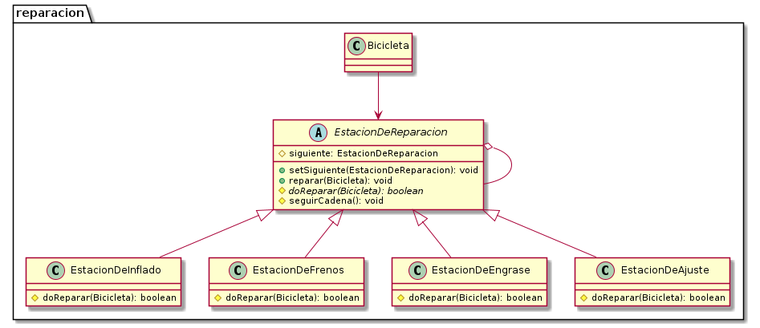

# Reparación de Bicicletas - Chain of Responsibility

En este ejemplo se utiliza el patrón de un modo diferente: cada manejador realiza su trabajo y "pasa la posta" al siguiente. El único que se ilustra del modo tradicional, es la `EstacionDeFrenos`, que si encuentra ambos frenos rotos, interrumpe la cadena.

## Diagrama de clases

