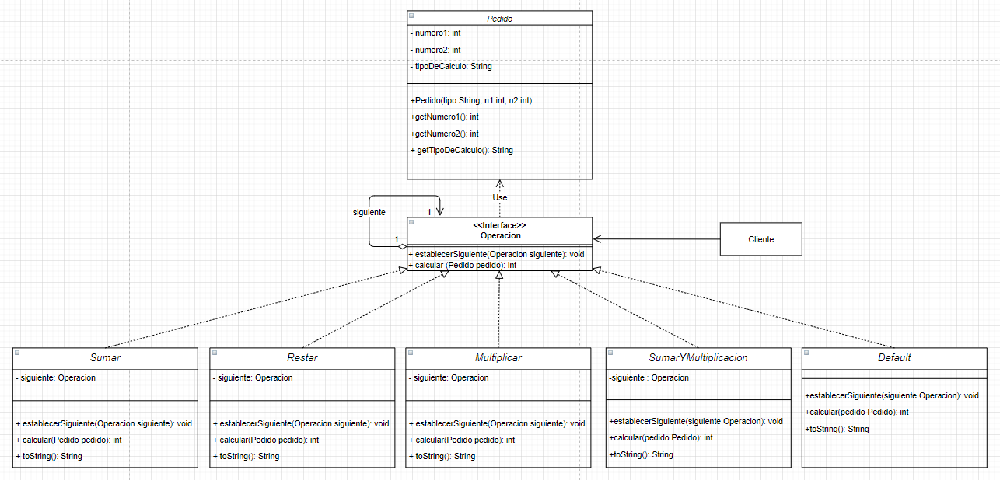

# Chain of responsability
Es un patrón de diseño de comportamiento que te permite pasar solicitudes a lo largo de una cadena de manejadores. Al recibir una solicitud, cada manejador decide si la procesa o si la pasa al siguiente manejador de la cadena.

Este problema tiene como objetivo demostrar cómo utilizar el patrón de "cadena de responsabilidad", utilizando para ello un problema simple:

### Introducción al problema
Se buscará crear una cadena de llamados qué dará el orden secuencial de como se irán atendiendo los pedidos que se soliciten, si estas no pueden ser atendidas por las clases manejadoras concretas (Sumar, Restar, Multiplicar, SumarYMultiplicar, Default), deberán pasar dicha solicitud a la siguiente manejadora. Este proceso se repite hasta que una manejadora pueda atender el pedido, en caso de que ninguna pueda hacerlo, terminará en una excepción no verificada.

> Se utiliza la clase Operación, para poder demostrar la ventaja especifica de este patrón.

## Clases
* **Clase Manejadora:** Es la interfaz común a todas las clases manejadoras concretas. Es la encargada de tener el método para manejar las solicitudes y tambien cuenta con un método para establecer el siguiente manejador.
En nuestro esquema, es la *clase Operacion*

* **Clase Manejadores Concretos:** Estas clases contienen el código para procesar las solicitudes y deciden si pueden procesarla o si la pasa a lo largo de la cadena.
En nuestro esquema, estas clases son: *Sumar, Restar, Multiplicar, SumarYMultiplicar, Default*.

* **Cliente:** Es el que compone la cadena, dependiendo de la lógica de la aplicación. Y, además, es la que envia una solicitud a cualquier manejador de la cadena; no necesariamente debe ser al primero.
En nuestro esquema, *Cliente* es la interpretación del *Test*.

## Características especiales del problema

1. La clase 'Operación' es la interfaz cuyos métodos serán implementados por las clases manejadoras concretas.
2. Hay que establecer el orden de las operaciones previo a la ejecución del algoritmo.
3. Todos los pedidos irán pasando los niveles de responsabilidad hasta llegar al correspondiente.
4. La clase 'default' se encargará de manejar las excepciones de pedidos no manejados.

## Puntos de extensión

* Se podrían agregar todas las operaciones que se deseen. Y, en caso de que se requiera, tambien agregar excepciones. Por ejemplo: una operacion *Division*, la cual, no se podría tener un denominador nulo.