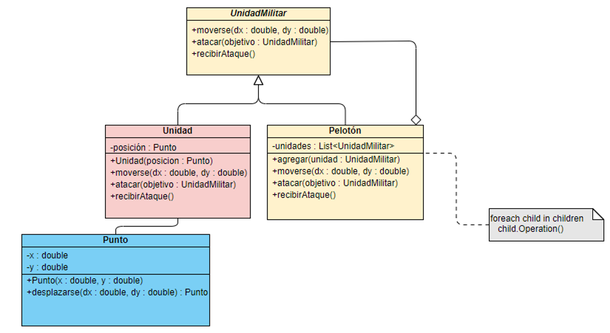

#Objetivo

Se tiene como objetivo dar solución a un problema utilizando el patrón de diseño Composite.

##Problema

Se desea construir un pelotón de unidades militares de las cuales cada unidad puede moverse utilizando un punto de coordenadas X e Y, realizar un ataque a un objetivo determinado que será una unidad militar y recibir un ataque.

##¿Para qué se utiliza el patrón de diseño Composite?

El patrón de diseño _*Composite*_ nos sirve para construir estructuras complejas partiendo de otras estructuras mucho más simples, dicho de otra manera, podemos crear estructuras compuestas las cuales están conformadas por otras estructuras más pequeñas.

##¿Qué componentes son necesarios en el Composite?

El patrón _*Composite*_ requiere mínimo de tres componentes para poder existir los cuales son Componente, Leaf o Rama y Composite.

#*Component*: Generalmente es una interface o clase abstracta la cual tiene las operaciones mínimas que serán utilizadas, este componente deberá ser extendido o implementado por los otros dos componentes Leaf y Composite. En nuestro ejemplo esto podría representar de forma abstracta una Unidad o todo el Peloton.
#*Leaf*: El leaf u hoja representa la parte más simple o pequeña de toda la estructura y este extiende o hereda de Component. En nuestro ejemplo, este representaría una Unidad del pelotón.
#*Composite*: Aquí es donde está la magia de este patrón, ya que el composite es una estructura conformada por otros Composite y Leaf. 

En nuestro ejemplo esto está representado por la clase Pelotón la cual tiene el método agregar que nos permite incorporar objetos de tipo Component (UnidadMilitar), sin embargo, el Componente es una Interface o Clase abstracta  por lo que podremos agregamos objetos de tipo Composite o Leaf. 

##Diagrama de clases de la solución

